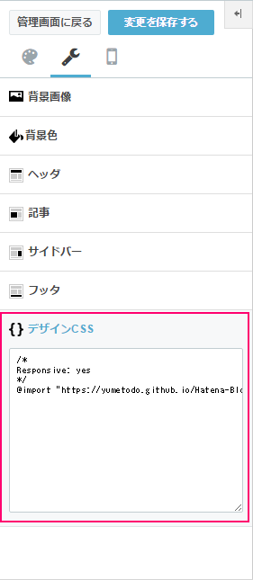
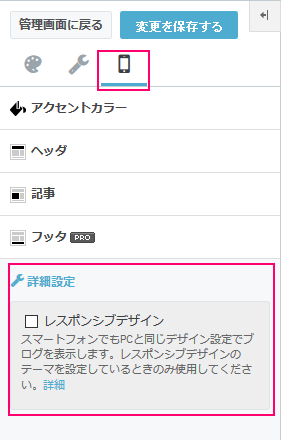
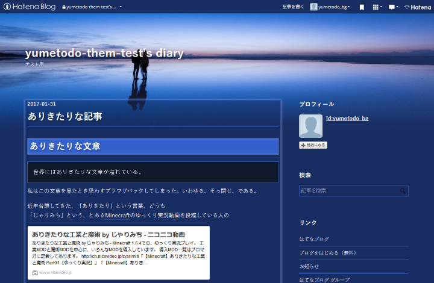
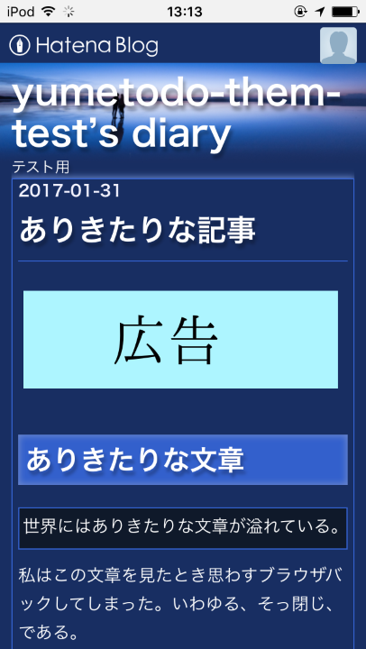

# Hatena-Blog-Themes

| Service     | CI Status                                                                                                                                                             |
|-------------|-----------------------------------------------------------------------------------------------------------------------------------------------------------------------|
| Greenkeeper | [](https://greenkeeper.io/)                                                         |
| lint/build/deploy  | [](https://app.shippable.com/projects/5893e78ef2e87f0f00914896) |

はてなブログで使えるテーマです。


## Use this theme

デザインCSSの部分に

```css
/*
Responsive: yes
*/
@import "https://yumetodo.github.io/Hatena-Blog-Themes/bin/style.min.css"
```

のように記載してください。

このテーマは後述の通りレスポンシブデザインに対応しています。``Responsive: yes``はモバイル向けのView Pointを自動で有効にするために必要です。  
[はてなブログテーマ制作の手引き - はてなブログ ヘルプ#responsive](http://help.hatenablog.com/entry/theme/custom-theme#responsive)



## レスポンシブデザイン

このテーマはレスポンシブデザインに対応しています。

スマートフォン→詳細設定のレスポンシブデザインを有効にしてください。



## イメージ画像




## Minify LESS(CSS)

LESSのCompileおよびMinifyには``lessc``とadd-onの``clean-css``を利用しています。

```
$ npm install
$ npm run build
```

## License

[License.md](./License.md)をごらんください。
